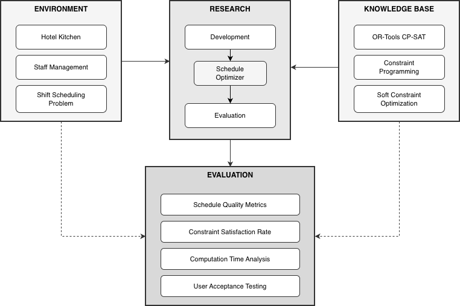
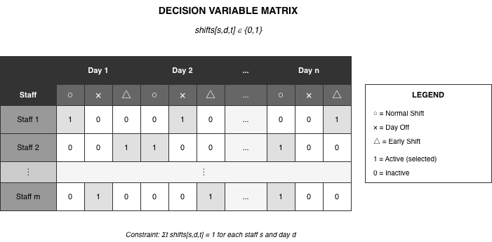
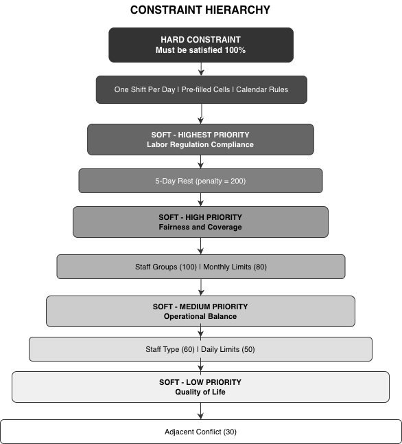
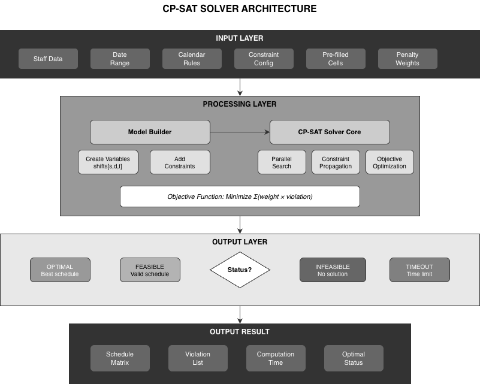
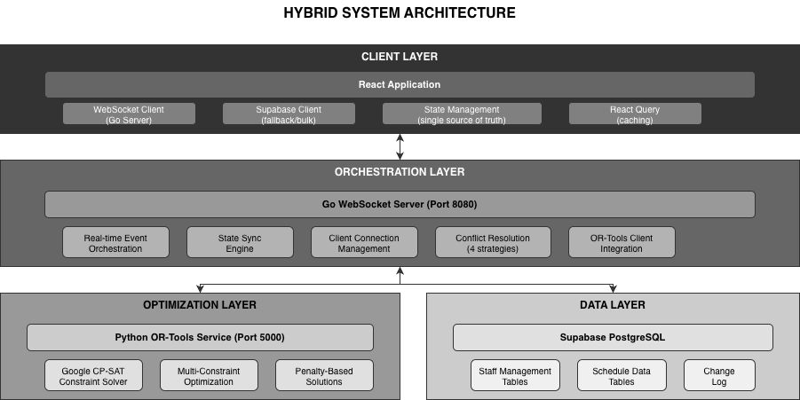
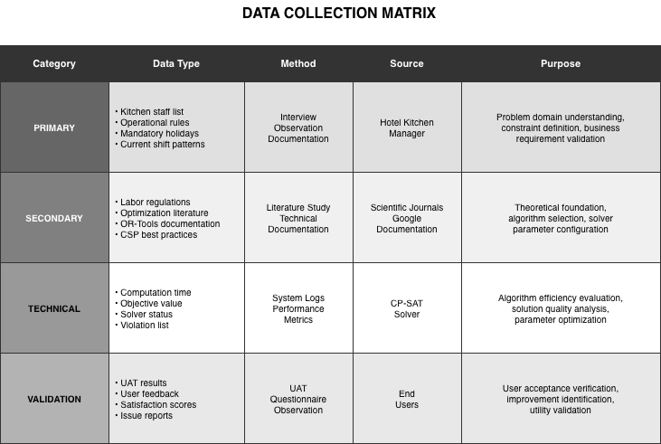
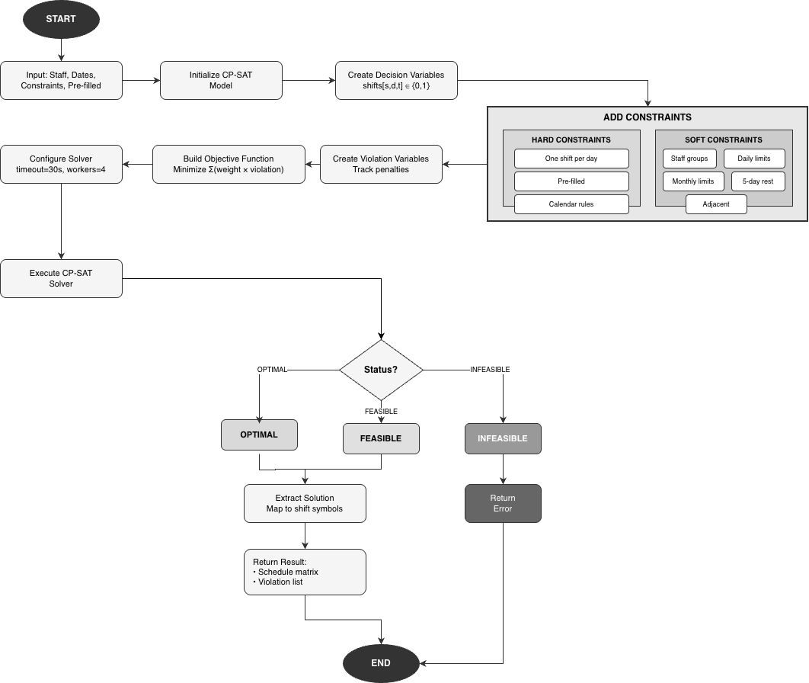
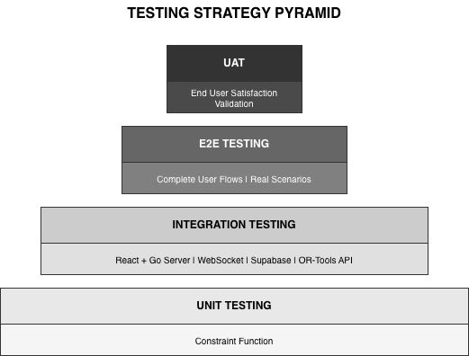

# CHAPTER 3
# RESEARCH METHODOLOGY

## 3.1 Research Framework

This research adopts the *Design Science Research* (DSR) *methodology* developed by Hevner et al. (2004) and Peffers et al. (2007). DSR was chosen because the research focus is on developing technology artifacts (scheduling systems) that provide practical solutions for real problems in the hospitality industry.

### 3.1.1 Design Science Research Framework



*Figure 3.1: Design Science Research Framework (Adapted from Hevner et al., 2004)*

### 3.1.2 DSR Research Stages

**Table 3.1: DSR Research Stages**

| Stage | Activity | Output |
|-------|----------|--------|
| 1. Problem Identification | Analysis of shift scheduling problems in hotel kitchen division | Problem statement & requirements |
| 2. Define Objectives | Defining optimal solution criteria | Success metrics & KPIs |
| 3. Design & Development | Development of CP-SAT model with soft constraints | Working prototype |
| 4. Demonstration | Implementation on real case study | Deployed system |
| 5. Evaluation | Testing and performance analysis | Evaluation report |
| 6. Communication | Documentation and publication of results | Thesis & publications |

## 3.2 Constraint Satisfaction Problem (CSP) Modeling

### 3.2.1 Formal Definition of CSP

According to Russell & Norvig (2020), *Constraint Satisfaction Problem* (CSP) is defined as a tuple (X, D, C) where:

- X = {x1, x2, ..., xn} is the set of variables
- D = {D1, D2, ..., Dn} is the domain for each variable
- C = {C1, C2, ..., Cm} is the set of constraints

### 3.2.2 CSP Formulation for Shift Scheduling

In the context of hotel kitchen division shift scheduling, CSP is formulated as follows:

**Decision Variables:**

X = {shifts[s,d,t] | s ∈ S, d ∈ D, t ∈ T}

Where:

- S = Set of staff (s1, s2, ..., sn)
- D = Set of dates in the period (d1, d2, ..., dm)
- T = Set of shift types {WORK, OFF, EARLY, LATE}

**Domain:**

D(shifts[s,d,t]) = {0, 1} (Boolean)

- Value 1 = Staff s gets shift type t on date d
- Value 0 = Staff s does NOT get shift type t on date d

**Total Variables:**

|X| = |S| × |D| × |T|

Example: 15 staff × 60 days × 4 types = 3,600 boolean variables

### 3.2.3 Variable Model Visualization



*Figure 3.2: Decision Variable Matrix Structure*

## 3.3 Constraint Classification: Hard vs Soft

### 3.3.1 Soft Constraint Optimization Approach

Unlike traditional scheduling systems that use *hard constraints* (must be 100% satisfied), this research adopts a *Soft Constraint Optimization* approach inspired by the work of Verfaillie & Jussien (2005) and Rossi et al. (2006).

**Advantages of Soft Constraints:**

1. **Always-Feasible Solutions**: Always produces a solution, never INFEASIBLE
2. **Trade-off Optimization**: Enables compromise between conflicting constraints
3. **Real-world Applicability**: More suitable for actual hotel operational conditions

### 3.3.2 Constraint Classification Table

**Table 3.2: Constraint Classification**

| No | Constraint | Type | Description | Penalty |
|----|------------|------|-------------|---------|
| 1 | One Shift Per Day | HARD | Each staff has only 1 shift type per day | - |
| 2 | Pre-filled Cells | HARD | Cells already filled by manager do not change | - |
| 3 | Calendar Must-Off | HARD | Mandatory off dates (holidays) | - |
| 4 | Staff Group | SOFT | Maximum 1 member off/early per group per day | 100 |
| 5 | Daily Limit Min | SOFT | Minimum staff off per day | 50 |
| 6 | Daily Limit Max | SOFT | Maximum staff off per day | 50 |
| 7 | Monthly Limit | SOFT | Min/max off days per staff per period | 80 |
| 8 | 5-Day Rest | SOFT | Maximum 5 consecutive work days | 200 |
| 9 | Staff Type Limit | SOFT | Limit per staff type | 60 |
| 10 | Adjacent Conflict | SOFT | Avoid certain sequential patterns | 30 |

### 3.3.3 Constraint Hierarchy Diagram



*Figure 3.3: Constraint Hierarchy by Priority*

## 3.4 Objective Function Formulation

### 3.4.1 Objective Function

Based on the penalty-based optimization approach from Hooker (2007), the objective function is formulated as total penalty minimization:

**Minimize:** Z = Σ(wᵢ × vᵢ) for all i in V

Where:

- V = Set of soft constraint violations
- wᵢ = Penalty weight for violation i
- vᵢ = Boolean variable (1 if violation occurs, 0 otherwise)

### 3.4.2 Implementation in OR-Tools CP-SAT

Implementation of the objective function in Python using OR-Tools CP-SAT:

```python
def _add_objective(self):
    """
    Build the objective function: Minimize total weighted violations.
    """
    if not self.violation_vars:
        return

    objective_terms = []
    for violation_var, weight, description in self.violation_vars:
        objective_terms.append(violation_var * weight)

    self.model.Minimize(sum(objective_terms))
```

### 3.4.3 Default Penalty Weights Configuration

**Table 3.3: Default Penalty Weights Configuration**

| Constraint | Penalty Weight | Priority |
|------------|----------------|----------|
| staff_group | 100 | High - group coverage important |
| daily_limit | 50 | Medium - daily balance |
| daily_limit_max | 50 | Medium - maximum daily limit |
| monthly_limit | 80 | High - monthly fairness |
| adjacent_conflict | 30 | Low - comfort |
| 5_day_rest | 200 | Very high - regulatory compliance |
| staff_type_limit | 60 | Medium-high - coverage per type |
| backup_coverage | 500 | Highest - operational continuity |

## 3.5 CP-SAT Solver Architecture

### 3.5.1 About Google OR-Tools CP-SAT

CP-SAT (Constraint Programming - Satisfiability) is a hybrid constraint solver developed by Google. According to official Google OR-Tools documentation (2024) and Perron & Furnon (2023), CP-SAT combines:

1. **Constraint Programming (CP)** - Domain propagation and inference
2. **SAT Solving** - Boolean satisfiability techniques
3. **Linear Programming (LP)** - Relaxation and cutting planes
4. **Local Search** - Large Neighborhood Search (LNS)

### 3.5.2 Solver Architecture Diagram



*Figure 3.4: Google OR-Tools CP-SAT Solver Architecture*

### 3.5.3 Solver Configuration

**Table 3.4: CP-SAT Solver Configuration**

| Parameter | Default Value | Description |
|-----------|---------------|-------------|
| max_time_in_seconds | 30 | Maximum search timeout |
| num_search_workers | 4 | Number of parallel workers |
| log_search_progress | True | Search progress logging |

## 3.6 Overall System Architecture

### 3.6.1 System Architecture Diagram

The shift scheduling system consists of four main integrated layers: User Interface Layer (React + Tailwind CSS), Application Layer (React Hooks + State Management), Optimization Service Layer (Python Flask + OR-Tools), and Data Layer (Supabase PostgreSQL).



*Figure 3.5: Shift Scheduling System Architecture*

## 3.7 Data Collection

### 3.7.1 Data Sources

Research data was obtained from a real case study of a hotel kitchen division with the following characteristics:

**Table 3.5: Research Data Characteristics**

| Aspect | Detail |
|--------|--------|
| Location | 4-5 star hotel |
| Division | Kitchen/Culinary |
| Number of Staff | 15-20 people |
| Data Period | January - December 2024 |
| Staff Types | Permanent, Contract, Part-time |

### 3.7.2 Types of Data Collected



*Figure 3.6: Data Collection Matrix*

## 3.8 Evaluation Methods

### 3.8.1 Quantitative Evaluation Metrics

**Table 3.6: Quantitative Evaluation Metrics**

| No | Metric | Formula | Target |
|----|--------|---------|--------|
| 1 | Constraint Satisfaction Rate | (Total - Violations) / Total × 100% | >= 95% |
| 2 | Hard Constraint Satisfaction | Hard satisfied / Total hard × 100% | 100% |
| 3 | Soft Constraint Satisfaction | Soft satisfied / Total soft × 100% | >= 85% |
| 4 | Computation Time | Time from input to output | <= 30s |
| 5 | Solution Quality Score | 1 - (Total penalty / Max penalty) | >= 0.9 |
| 6 | Fairness Index | Std deviation of off days among staff | <= 2 days |

### 3.8.2 Qualitative Evaluation Metrics

**Table 3.7: Qualitative Evaluation Metrics**

| No | Aspect | Measurement Method |
|----|--------|-------------------|
| 1 | User Satisfaction | Likert scale questionnaire 1-5 |
| 2 | Ease of Use | System Usability Scale (SUS) |
| 3 | Perceived Fairness | Interview with staff |
| 4 | Manager Acceptance | Focus Group Discussion |

### 3.8.3 Comparison with Baseline Methods

**Table 3.8: Scheduling Method Comparison**

| Aspect | Manual | Rule-based | CP-SAT (Proposed) |
|--------|--------|------------|-------------------|
| Creation time | 4-8 hours | 5-10 minutes | < 30 seconds |
| Optimality | Not guaranteed | Heuristic | Mathematically optimal |
| Constraint handling | Trial-and-error | Sequential | Simultaneous |
| Scalability | Not scalable | Limited | Highly scalable |
| Consistency | Varies | Consistent | Optimal & consistent |

## 3.9 Constraint Implementation in Code

### 3.9.1 Basic Constraint: One Shift Per Day

Implementation of the basic constraint ensuring each staff has only one shift type per day:

```python
def _add_basic_constraints(self):
    """Each staff has exactly one shift type per day."""
    for staff in self.staff_members:
        for date in self.date_range:
            self.model.AddExactlyOne([
                self.shifts[(staff['id'], date, shift)]
                for shift in range(4)  # WORK, OFF, EARLY, LATE
            ])
```

### 3.9.2 Soft Constraint: Staff Group

Implementation of soft constraint for staff groups with the off-equivalent concept:

```python
def _add_staff_group_constraints(self):
    """Maximum 1 member from each group can be off OR early per day."""
    for group in self.staff_groups:
        for date in self.date_range:
            violation = self.model.NewBoolVar(
                f'group_violation_{group["id"]}_{date}'
            )

            off_equivalent = sum(
                2 * self.shifts[(s['id'], date, self.SHIFT_OFF)] +
                self.shifts[(s['id'], date, self.SHIFT_EARLY)]
                for s in group['members']
            )

            self.model.Add(off_equivalent <= 2).OnlyEnforceIf(violation.Not())

            self.violation_vars.append(
                (violation, self.PENALTY_WEIGHTS['staff_group'],
                 f'group_{group["id"]}_{date}')
            )
```

### 3.9.3 Soft Constraint: 5-Day Rest

Implementation of constraint to ensure maximum 5 consecutive work days:

```python
def _add_5_day_rest_constraint(self):
    """Maximum 5 consecutive work days."""
    for staff in self.staff_members:
        for i in range(len(self.date_range) - 5):
            violation = self.model.NewBoolVar(f'5day_{staff["id"]}_{i}')

            work_days = sum(
                self.shifts[(staff['id'], self.date_range[i+j], self.SHIFT_WORK)]
                for j in range(6)
            )

            self.model.Add(work_days <= 5).OnlyEnforceIf(violation.Not())

            self.violation_vars.append(
                (violation, self.PENALTY_WEIGHTS['5_day_rest'],
                 f'5day_{staff["id"]}_{i}')
            )
```

## 3.10 Optimization Process Flow

### 3.10.1 Optimization Process Flowchart

The optimization process starts from data input (staff, dates, constraints, pre-filled), followed by CP-SAT model initialization, decision variable creation, constraint addition (hard and soft), objective function construction, solver configuration, solver execution, and solution extraction.



*Figure 3.7: Optimization Process Flowchart*

## 3.11 Validation and Verification

### 3.11.1 Testing Strategy

The testing strategy follows a testing pyramid consisting of Unit Tests (testing individual constraint functions), Integration Tests (API + Solver testing), and End-to-End Tests (browser automation).



*Figure 3.8: Testing Strategy Pyramid*

### 3.11.2 Test Cases

**Table 3.9: Test Cases**

| ID | Test Case | Input | Expected Output |
|----|-----------|-------|-----------------|
| TC01 | Basic constraint | 5 staff, 7 days | Each staff has 1 shift/day |
| TC02 | Pre-filled preservation | Pre-filled × day 1 | × preserved in output |
| TC03 | Staff group constraint | 2 members in group | Max 1 off per day |
| TC04 | 5-day rest constraint | 7 consecutive days | At least 1 rest in days 1-6 |
| TC05 | Monthly limit | Min=8, Max=10 | Output has 8-10 off days |
| TC06 | Large scale performance | 20 staff, 60 days | Solution in < 30s |

## 3.12 Research Schedule

**Table 3.10: Research Schedule**

| Phase | Activity | Duration |
|-------|----------|----------|
| Phase 1 | Literature study & requirements analysis | 4 weeks |
| Phase 2 | CSP model design & constraint mapping | 3 weeks |
| Phase 3 | OR-Tools optimizer implementation | 4 weeks |
| Phase 4 | UI integration & testing | 3 weeks |
| Phase 5 | Evaluation & result analysis | 2 weeks |
| Phase 6 | Report writing & revision | 4 weeks |

## 3.13 References

### Academic References

[1] Hevner, A. R., March, S. T., Park, J., & Ram, S. (2004). Design Science in Information Systems Research. MIS Quarterly, 28(1), 75-105.

[2] Peffers, K., Tuunanen, T., Rothenberger, M. A., & Chatterjee, S. (2007). A Design Science Research Methodology for Information Systems Research. Journal of Management Information Systems, 24(3), 45-77.

[3] Russell, S. J., & Norvig, P. (2020). Artificial Intelligence: A Modern Approach (4th ed.). Pearson.

[4] Rossi, F., Van Beek, P., & Walsh, T. (2006). Handbook of Constraint Programming. Elsevier.

[5] Verfaillie, G., & Jussien, N. (2005). Constraint Solving in Uncertain and Dynamic Environments: A Survey. Constraints, 10(3), 253-281.

[6] Hooker, J. N. (2007). Integrated Methods for Optimization. Springer.

[7] Krupke, D. (2024). CP-SAT Primer: Using and Understanding Google OR-Tools' CP-SAT Solver. TU Braunschweig.

[8] Van Den Bergh, J., Belien, J., De Bruecker, P., Demeulemeester, E., & De Boeck, L. (2013). Personnel Scheduling: A Literature Review. European Journal of Operational Research, 226(3), 367-385.

[9] Burke, E. K., De Causmaecker, P., Berghe, G. V., & Van Landeghem, H. (2004). The State of the Art of Nurse Rostering. Journal of Scheduling, 7(6), 441-499.

[10] Ernst, A. T., Jiang, H., Krishnamoorthy, M., & Sier, D. (2004). Staff Scheduling and Rostering: A Review of Applications, Methods and Models. European Journal of Operational Research, 153(1), 3-27.

### Technical References

[11] Google OR-Tools Documentation (2024). CP-SAT Solver Guide. https://developers.google.com/optimization/cp/cp_solver

[12] Google OR-Tools GitHub Repository (2024). Constraint Programming Examples. https://github.com/google/or-tools

[13] Perron, L., & Furnon, V. (2023). OR-Tools by Google. Operations Research Tools. https://developers.google.com/optimization

[14] Flask Documentation (2024). Flask Web Framework. https://flask.palletsprojects.com/

[15] React Documentation (2024). React: A JavaScript Library for Building User Interfaces. https://react.dev/
