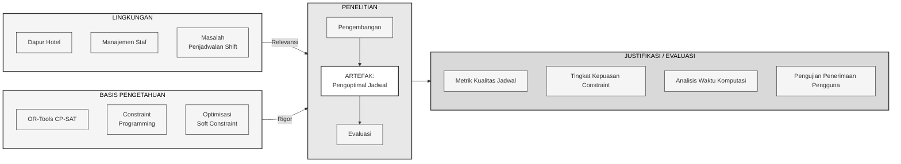
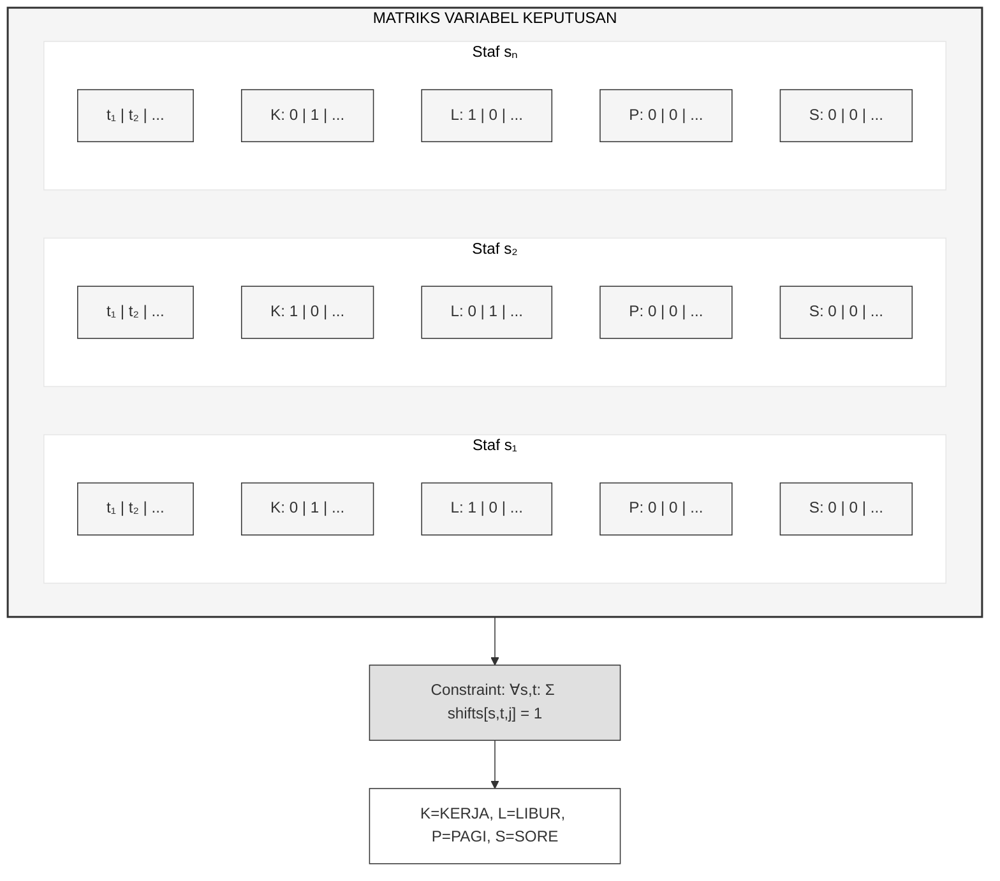
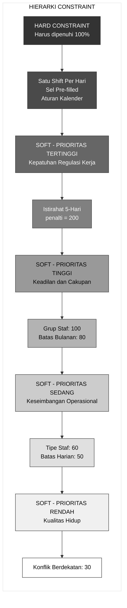
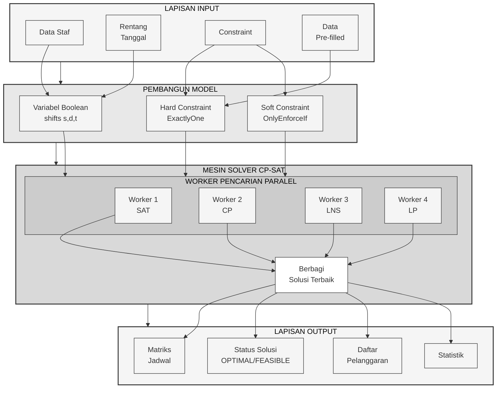
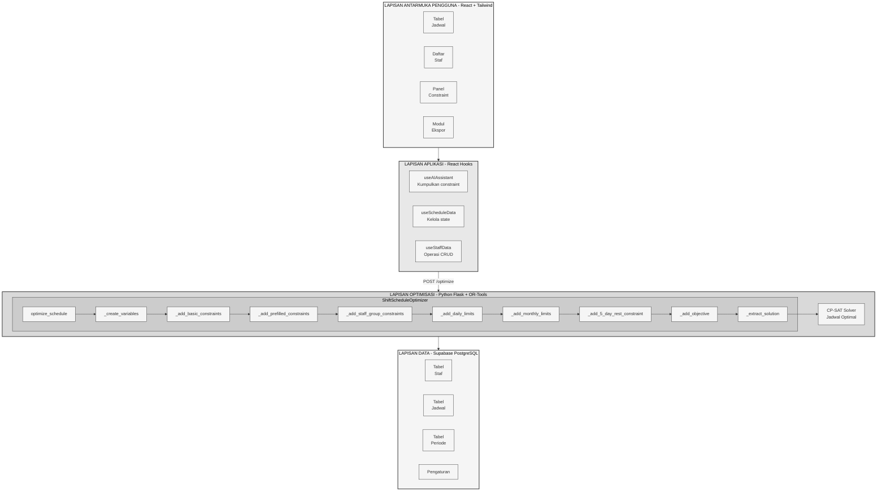
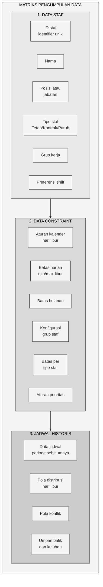
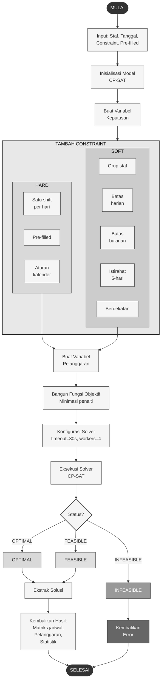
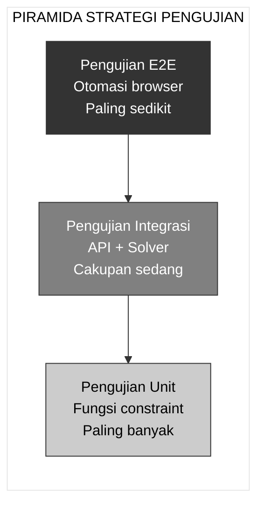
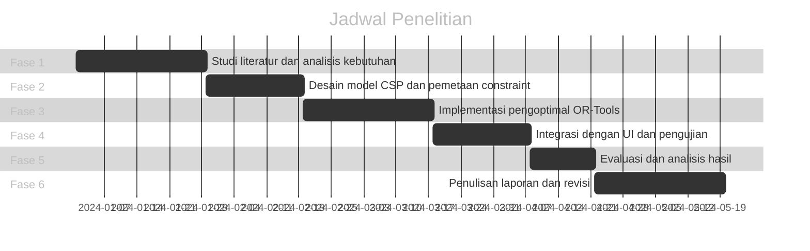

# BAB 3 - Diagram Mermaid

Kumpulan diagram Mermaid untuk BAB 3 Metodologi Penelitian.
Buka di https://mermaid.live/ untuk melihat dan export diagram.

---

## Gambar 3.1: Kerangka Design Science Research



---

## Gambar 3.2: Matriks Variabel Keputusan



---

## Gambar 3.3: Piramida Hierarki Constraint



---

## Gambar 3.4: Arsitektur Solver CP-SAT



---

## Gambar 3.5: Arsitektur Sistem



---

## Gambar 3.6: Matriks Pengumpulan Data



---

## Gambar 3.7: Flowchart Proses Optimisasi



---

## Gambar 3.8: Piramida Strategi Pengujian



---

## Bonus: Gantt Chart - Jadwal Penelitian



---

## Cara Menggunakan

1. Buka **https://mermaid.live/**
2. Copy salah satu kode diagram di atas (termasuk bagian `%%{init:...}%%` untuk tema monokrom)
3. Paste di editor sebelah kiri
4. Diagram akan muncul di sebelah kanan
5. Klik **Actions** → **Export PNG** atau **Export SVG** untuk download

### Tips Export:
- **PNG**: Cocok untuk dokumen Word/PDF
- **SVG**: Cocok untuk web dan bisa di-zoom tanpa blur
- **PDF**: Cocok untuk presentasi

---

## Konfigurasi Tema (Monokrom)

Semua diagram menggunakan konfigurasi tema monokrom:

```
%%{init: {'theme': 'base', 'themeVariables': {
    'primaryColor': '#f5f5f5',
    'primaryTextColor': '#333',
    'primaryBorderColor': '#333',
    'lineColor': '#333',
    'secondaryColor': '#e0e0e0',
    'tertiaryColor': '#fff'
}}}%%
```

Warna yang digunakan:
- `#333` - Hitam/gelap (border, teks)
- `#4a4a4a` - Abu-abu tua
- `#666` - Abu-abu sedang gelap
- `#808080` - Abu-abu sedang
- `#999` - Abu-abu
- `#b3b3b3` - Abu-abu muda
- `#ccc` - Abu-abu terang
- `#d9d9d9` - Abu-abu sangat terang
- `#e0e0e0` - Hampir putih
- `#e8e8e8` - Hampir putih
- `#f0f0f0` - Hampir putih
- `#f5f5f5` - Putih keabu-abuan
- `#fff` - Putih
