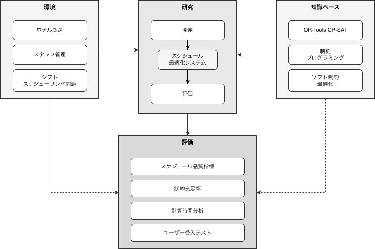
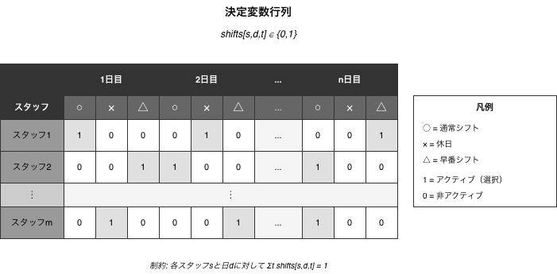
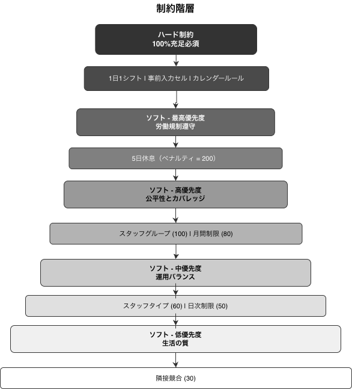
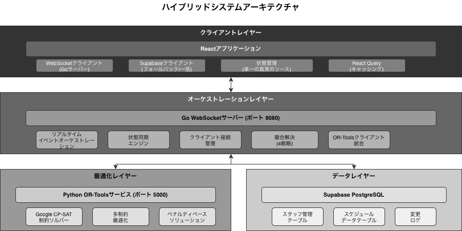
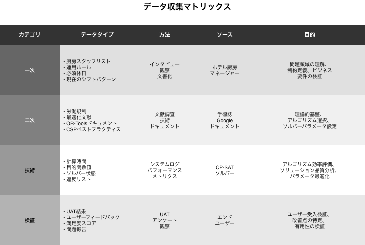
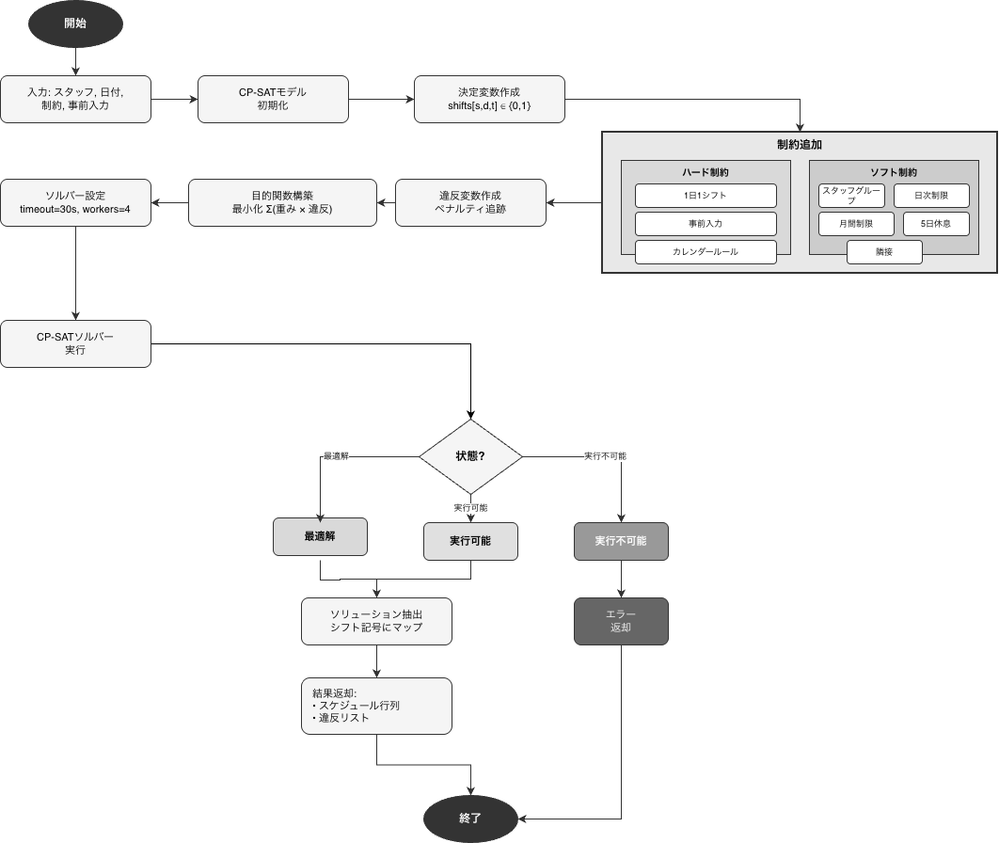
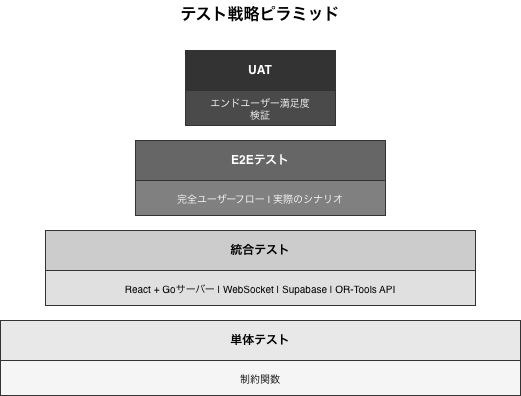

# 第3章
# 研究方法論

## 3.1 研究フレームワーク

本研究は、Hevner et al. (2004)およびPeffers et al. (2007)によって開発された*デザインサイエンスリサーチ* (DSR) *手法*を採用する。DSRが選ばれた理由は、本研究が技術的アーティファクト(スケジューリングシステム)の開発に焦点を当て、ホスピタリティ業界における実際の問題に対する実用的なソリューションを提供するためである。

### 3.1.1 デザインサイエンスリサーチフレームワーク



*図3.1: デザインサイエンスリサーチフレームワーク (Hevner et al., 2004より改変)*

### 3.1.2 DSR研究段階

**表3.1: DSR研究段階**

| 段階 | 活動 | 成果物 |
|------|------|--------|
| 1. 問題の特定 | ホテル厨房部門におけるシフトスケジューリング問題の分析 | 問題提起と要件定義 |
| 2. 目的の定義 | 最適解の基準を定義 | 成功指標とKPI |
| 3. 設計・開発 | ソフト制約を持つCP-SATモデルの開発 | 動作プロトタイプ |
| 4. デモンストレーション | 実際のケーススタディでの実装 | デプロイされたシステム |
| 5. 評価 | テストとパフォーマンス分析 | 評価レポート |
| 6. コミュニケーション | 結果の文書化と公表 | 論文と出版物 |

## 3.2 制約充足問題(CSP)のモデリング

### 3.2.1 CSPの形式的定義

Russell & Norvig (2020)によると、*制約充足問題* (CSP)は、タプル(X, D, C)として定義される：

- X = {x1, x2, ..., xn} は変数の集合
- D = {D1, D2, ..., Dn} は各変数のドメイン
- C = {C1, C2, ..., Cm} は制約の集合

### 3.2.2 シフトスケジューリングのためのCSP定式化

ホテル厨房部門のシフトスケジューリングの文脈において、CSPは以下のように定式化される：

**決定変数:**

X = {shifts[s,d,t] | s ∈ S, d ∈ D, t ∈ T}

ここで:

- S = スタッフの集合 (s1, s2, ..., sn)
- D = 期間内の日付の集合 (d1, d2, ..., dm)
- T = シフトタイプの集合 {勤務, 休日, 早番, 遅番}

**ドメイン:**

D(shifts[s,d,t]) = {0, 1} (ブール値)

- 値1 = スタッフsが日付dにシフトタイプtを割り当てられる
- 値0 = スタッフsが日付dにシフトタイプtを割り当てられない

**変数の総数:**

|X| = |S| × |D| × |T|

例: 15名のスタッフ × 60日 × 4タイプ = 3,600個のブール変数

### 3.2.3 変数モデルの可視化



*図3.2: 決定変数行列の構造*

## 3.3 制約の分類: ハード vs ソフト

### 3.3.1 ソフト制約最適化アプローチ

従来のスケジューリングシステムが*ハード制約*(100%満たす必要がある)を使用するのとは異なり、本研究はVerfaillie & Jussien (2005)およびRossi et al. (2006)の研究に触発された*ソフト制約最適化*アプローチを採用する。

**ソフト制約の利点:**

1. **常に実行可能な解**: 常に解を生成し、実行不可能(INFEASIBLE)にならない
2. **トレードオフ最適化**: 競合する制約間の妥協を可能にする
3. **実世界への適用性**: 実際のホテル運営条件により適している

### 3.3.2 制約分類表

**表3.2: 制約分類**

| No | 制約 | タイプ | 説明 | ペナルティ |
|----|------|--------|------|-----------|
| 1 | 1日1シフト | ハード | 各スタッフは1日に1つのシフトタイプのみ | - |
| 2 | 事前入力セル | ハード | マネージャーが既に入力したセルは変更しない | - |
| 3 | カレンダー必須休日 | ハード | 必須休日(祝日) | - |
| 4 | スタッフグループ | ソフト | グループごとに1日あたり最大1名が休日/早番 | 100 |
| 5 | 日次制限最小 | ソフト | 1日あたりの最小休日スタッフ数 | 50 |
| 6 | 日次制限最大 | ソフト | 1日あたりの最大休日スタッフ数 | 50 |
| 7 | 月次制限 | ソフト | 期間ごとのスタッフあたりの最小/最大休日数 | 80 |
| 8 | 5日間休息 | ソフト | 最大5日間の連続勤務 | 200 |
| 9 | スタッフタイプ制限 | ソフト | スタッフタイプごとの制限 | 60 |
| 10 | 隣接競合 | ソフト | 特定の連続パターンを回避 | 30 |

### 3.3.3 制約階層図



*図3.3: 優先度による制約階層*

## 3.4 目的関数の定式化

### 3.4.1 目的関数

Hooker (2007)のペナルティベース最適化アプローチに基づき、目的関数は総ペナルティの最小化として定式化される：

**最小化:** Z = Σ(wᵢ × vᵢ) for all i in V

ここで:

- V = ソフト制約違反の集合
- wᵢ = 違反iのペナルティ重み
- vᵢ = ブール変数 (違反が発生した場合1、そうでない場合0)

### 3.4.2 OR-Tools CP-SATでの実装

OR-Tools CP-SATを使用したPythonでの目的関数の実装：

```python
def _add_objective(self):
    """
    目的関数を構築: 加重違反の合計を最小化
    """
    if not self.violation_vars:
        return

    objective_terms = []
    for violation_var, weight, description in self.violation_vars:
        objective_terms.append(violation_var * weight)

    self.model.Minimize(sum(objective_terms))
```

### 3.4.3 デフォルトペナルティ重み設定

**表3.3: デフォルトペナルティ重み設定**

| 制約 | ペナルティ重み | 優先度 |
|------|---------------|--------|
| staff_group | 100 | 高 - グループカバレッジが重要 |
| daily_limit | 50 | 中 - 日次バランス |
| daily_limit_max | 50 | 中 - 日次最大制限 |
| monthly_limit | 80 | 高 - 月次公平性 |
| adjacent_conflict | 30 | 低 - 快適性 |
| 5_day_rest | 200 | 非常に高 - 規制コンプライアンス |
| staff_type_limit | 60 | 中高 - タイプ別カバレッジ |
| backup_coverage | 500 | 最高 - 業務継続性 |

## 3.5 CP-SATソルバーアーキテクチャ

### 3.5.1 Google OR-Tools CP-SATについて

CP-SAT (制約プログラミング - 充足可能性)は、Googleによって開発されたハイブリッド制約ソルバーである。公式のGoogle OR-Toolsドキュメント(2024)およびPerron & Furnon (2023)によると、CP-SATは以下を組み合わせている：

1. **制約プログラミング(CP)** - ドメイン伝播と推論
2. **SAT解法** - ブール充足可能性技術
3. **線形計画法(LP)** - 緩和とカット平面
4. **局所探索** - 大規模近傍探索(LNS)

### 3.5.2 ソルバーアーキテクチャ図


*図3.4: Google OR-Tools CP-SATソルバーアーキテクチャ*

### 3.5.3 ソルバー設定

**表3.4: CP-SATソルバー設定**

| パラメータ | デフォルト値 | 説明 |
|-----------|-------------|------|
| max_time_in_seconds | 30 | 最大探索タイムアウト |
| num_search_workers | 4 | 並列ワーカー数 |
| log_search_progress | True | 探索進捗ロギング |

## 3.6 システム全体アーキテクチャ

### 3.6.1 システムアーキテクチャ図

シフトスケジューリングシステムは、統合された4つの主要レイヤーで構成される：ユーザーインターフェースレイヤー(React + Tailwind CSS)、アプリケーションレイヤー(React Hooks + 状態管理)、最適化サービスレイヤー(Python Flask + OR-Tools)、およびデータレイヤー(Supabase PostgreSQL)。



*図3.5: シフトスケジューリングシステムアーキテクチャ*

## 3.7 データ収集

### 3.7.1 データソース

研究データは、以下の特性を持つホテル厨房部門の実際のケーススタディから取得された：

**表3.5: 研究データ特性**

| 側面 | 詳細 |
|------|------|
| 場所 | 4-5つ星ホテル |
| 部門 | 厨房/調理 |
| スタッフ数 | 15-20名 |
| データ期間 | 2024年1月 - 12月 |
| スタッフタイプ | 正社員、契約社員、パートタイム |

### 3.7.2 収集されたデータタイプ



*図3.6: データ収集マトリックス*

## 3.8 評価方法

### 3.8.1 定量的評価指標

**表3.6: 定量的評価指標**

| No | 指標 | 式 | 目標 |
|----|------|-----|------|
| 1 | 制約充足率 | (合計 - 違反) / 合計 × 100% | >= 95% |
| 2 | ハード制約充足率 | 充足したハード制約 / 総ハード制約 × 100% | 100% |
| 3 | ソフト制約充足率 | 充足したソフト制約 / 総ソフト制約 × 100% | >= 85% |
| 4 | 計算時間 | 入力から出力までの時間 | <= 30秒 |
| 5 | 解の品質スコア | 1 - (総ペナルティ / 最大ペナルティ) | >= 0.9 |
| 6 | 公平性指数 | スタッフ間の休日の標準偏差 | <= 2日 |

### 3.8.2 定性的評価指標

**表3.7: 定性的評価指標**

| No | 側面 | 測定方法 |
|----|------|---------|
| 1 | ユーザー満足度 | リッカート尺度アンケート1-5 |
| 2 | 使いやすさ | システムユーザビリティ尺度(SUS) |
| 3 | 知覚される公平性 | スタッフへのインタビュー |
| 4 | マネージャーの受容性 | フォーカスグループディスカッション |

### 3.8.3 ベースライン手法との比較

**表3.8: スケジューリング手法の比較**

| 側面 | 手動 | ルールベース | CP-SAT (提案) |
|------|------|------------|--------------|
| 作成時間 | 4-8時間 | 5-10分 | < 30秒 |
| 最適性 | 保証なし | ヒューリスティック | 数学的に最適 |
| 制約処理 | 試行錯誤 | 逐次的 | 同時的 |
| スケーラビリティ | スケール不可 | 制限あり | 高度にスケーラブル |
| 一貫性 | 変動あり | 一貫性あり | 最適かつ一貫性あり |

## 3.9 コードでの制約実装

### 3.9.1 基本制約: 1日1シフト

各スタッフが1日に1つのシフトタイプのみを持つことを保証する基本制約の実装：

```python
def _add_basic_constraints(self):
    """各スタッフは1日に正確に1つのシフトタイプを持つ。"""
    for staff in self.staff_members:
        for date in self.date_range:
            self.model.AddExactlyOne([
                self.shifts[(staff['id'], date, shift)]
                for shift in range(4)  # 勤務, 休日, 早番, 遅番
            ])
```

### 3.9.2 ソフト制約: スタッフグループ

休日相当概念を持つスタッフグループのソフト制約の実装：

```python
def _add_staff_group_constraints(self):
    """各グループから1日あたり最大1名が休日または早番。"""
    for group in self.staff_groups:
        for date in self.date_range:
            violation = self.model.NewBoolVar(
                f'group_violation_{group["id"]}_{date}'
            )

            off_equivalent = sum(
                2 * self.shifts[(s['id'], date, self.SHIFT_OFF)] +
                self.shifts[(s['id'], date, self.SHIFT_EARLY)]
                for s in group['members']
            )

            self.model.Add(off_equivalent <= 2).OnlyEnforceIf(violation.Not())

            self.violation_vars.append(
                (violation, self.PENALTY_WEIGHTS['staff_group'],
                 f'group_{group["id"]}_{date}')
            )
```

### 3.9.3 ソフト制約: 5日間休息

最大5日間の連続勤務を保証する制約の実装：

```python
def _add_5_day_rest_constraint(self):
    """最大5日間の連続勤務。"""
    for staff in self.staff_members:
        for i in range(len(self.date_range) - 5):
            violation = self.model.NewBoolVar(f'5day_{staff["id"]}_{i}')

            work_days = sum(
                self.shifts[(staff['id'], self.date_range[i+j], self.SHIFT_WORK)]
                for j in range(6)
            )

            self.model.Add(work_days <= 5).OnlyEnforceIf(violation.Not())

            self.violation_vars.append(
                (violation, self.PENALTY_WEIGHTS['5_day_rest'],
                 f'5day_{staff["id"]}_{i}')
            )
```

## 3.10 最適化プロセスフロー

### 3.10.1 最適化プロセスフローチャート

最適化プロセスは、データ入力(スタッフ、日付、制約、事前入力)から始まり、CP-SATモデルの初期化、決定変数の作成、制約の追加(ハードおよびソフト)、目的関数の構築、ソルバーの設定、ソルバーの実行、および解の抽出と続く。



*図3.7: 最適化プロセスフローチャート*

## 3.11 検証と確認

### 3.11.1 テスト戦略

テスト戦略は、単体テスト(個別の制約関数のテスト)、統合テスト(API + ソルバーのテスト)、およびエンドツーエンドテスト(ブラウザ自動化)で構成されるテストピラミッドに従う。



*図3.8: テスト戦略ピラミッド*

### 3.11.2 テストケース

**表3.9: テストケース**

| ID | テストケース | 入力 | 期待される出力 |
|----|------------|------|--------------|
| TC01 | 基本制約 | 5名のスタッフ、7日間 | 各スタッフが1日1シフト |
| TC02 | 事前入力の保持 | 1日目に×が事前入力 | 出力で×が保持される |
| TC03 | スタッフグループ制約 | グループ内2名 | 1日あたり最大1名が休日 |
| TC04 | 5日間休息制約 | 7日連続 | 1-6日目に少なくとも1日の休息 |
| TC05 | 月次制限 | 最小=8、最大=10 | 出力が8-10日の休日 |
| TC06 | 大規模パフォーマンス | 20名のスタッフ、60日間 | < 30秒で解を取得 |

## 3.12 研究スケジュール

**表3.10: 研究スケジュール**

| フェーズ | 活動 | 期間 |
|---------|------|------|
| フェーズ1 | 文献調査と要件分析 | 4週間 |
| フェーズ2 | CSPモデル設計と制約マッピング | 3週間 |
| フェーズ3 | OR-Toolsオプティマイザー実装 | 4週間 |
| フェーズ4 | UI統合とテスト | 3週間 |
| フェーズ5 | 評価と結果分析 | 2週間 |
| フェーズ6 | レポート作成と改訂 | 4週間 |

## 3.13 参考文献

### 学術参考文献

[1] Hevner, A. R., March, S. T., Park, J., & Ram, S. (2004). Design Science in Information Systems Research. MIS Quarterly, 28(1), 75-105.

[2] Peffers, K., Tuunanen, T., Rothenberger, M. A., & Chatterjee, S. (2007). A Design Science Research Methodology for Information Systems Research. Journal of Management Information Systems, 24(3), 45-77.

[3] Russell, S. J., & Norvig, P. (2020). Artificial Intelligence: A Modern Approach (4th ed.). Pearson.

[4] Rossi, F., Van Beek, P., & Walsh, T. (2006). Handbook of Constraint Programming. Elsevier.

[5] Verfaillie, G., & Jussien, N. (2005). Constraint Solving in Uncertain and Dynamic Environments: A Survey. Constraints, 10(3), 253-281.

[6] Hooker, J. N. (2007). Integrated Methods for Optimization. Springer.

[7] Krupke, D. (2024). CP-SAT Primer: Using and Understanding Google OR-Tools' CP-SAT Solver. TU Braunschweig.

[8] Van Den Bergh, J., Belien, J., De Bruecker, P., Demeulemeester, E., & De Boeck, L. (2013). Personnel Scheduling: A Literature Review. European Journal of Operational Research, 226(3), 367-385.

[9] Burke, E. K., De Causmaecker, P., Berghe, G. V., & Van Landeghem, H. (2004). The State of the Art of Nurse Rostering. Journal of Scheduling, 7(6), 441-499.

[10] Ernst, A. T., Jiang, H., Krishnamoorthy, M., & Sier, D. (2004). Staff Scheduling and Rostering: A Review of Applications, Methods and Models. European Journal of Operational Research, 153(1), 3-27.

### 技術参考文献

[11] Google OR-Tools Documentation (2024). CP-SAT Solver Guide. https://developers.google.com/optimization/cp/cp_solver

[12] Google OR-Tools GitHub Repository (2024). Constraint Programming Examples. https://github.com/google/or-tools

[13] Perron, L., & Furnon, V. (2023). OR-Tools by Google. Operations Research Tools. https://developers.google.com/optimization

[14] Flask Documentation (2024). Flask Web Framework. https://flask.palletsprojects.com/

[15] React Documentation (2024). React: A JavaScript Library for Building User Interfaces. https://react.dev/
